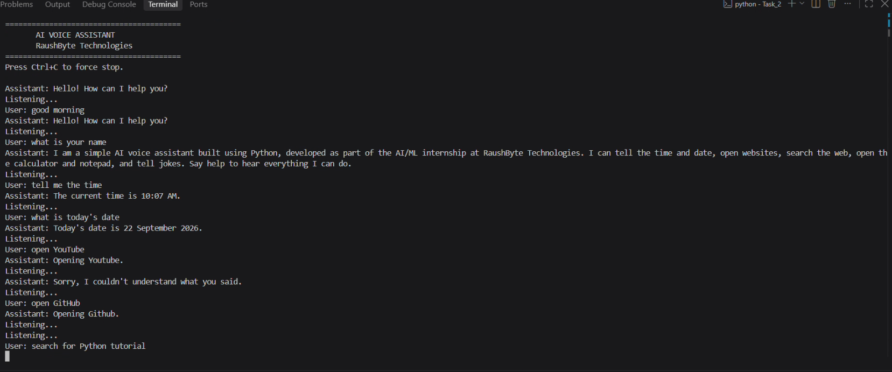

# 🎙️ AI Voice Assistant using Python

A beginner-friendly voice assistant developed as part of the **RaushByte Technologies AI/ML Internship**.

**Internship:** AI/ML Internship – RaushByte Technologies
**Task:** Level 2 – Task 2: Voice Assistant
**Prepared By:** Sandhiya

---

## 🎯 Objective

Build a simple voice assistant that:

* 🎤 Listens to the user's voice through the microphone
* 📝 Converts speech into text
* 🔍 Identifies predefined voice commands
* ⚙️ Performs the matching task such as time, date, websites, search, apps, and jokes
* 🔊 Responds using text-to-speech
* ❓ Handles unknown commands gracefully
* 🔄 Keeps listening until the user asks it to exit

> **Note:** This is a simple demonstration of a voice-controlled assistant, not a full commercial AI assistant.

---

## ✨ Features

* Voice input through the microphone
* Speech recognition using **SpeechRecognition + Google's free Web Speech API**
* Text-to-speech replies using **pyttsx3** (offline)
* Current time and today's date from the live system clock
* Open websites:

  * Google
  * YouTube
  * GitHub
* Web search by voice

  * Example: `"search for Python tutorials"`
* Launch predefined applications on Windows:

  * Calculator
  * Notepad
* Predefined joke responses
* Help command listing supported commands
* Graceful handling of unknown commands
* Exit using:

  * `"exit"`
  * `"quit"`
  * `"stop"`
  * `"goodbye"`
  * `"bye"`
* `Ctrl + C` support for forced termination
* Error handling for:

  * Microphone unavailable
  * Speech not understood
  * Recognition service unavailable

---

## 🔄 How It Works

```text
                ┌───────────────┐
                │     START     │
                └───────┬───────┘
                        ↓
          ┌─────────────────────────┐
          │ Initialize Assistant    │
          └────────────┬────────────┘
                       ↓
          ┌─────────────────────────┐
          │ Activate Microphone     │
          └────────────┬────────────┘
                       ↓
          ┌─────────────────────────┐
          │ Listen to User Voice    │
          └────────────┬────────────┘
                       ↓
          ┌─────────────────────────┐
          │ Speech-to-Text          │
          └────────────┬────────────┘
                       ↓
          ┌─────────────────────────┐
          │ Process User Command    │
          └────────────┬────────────┘
                       ↓
              ┌────────────────┐
              │ Identify Intent│
              └───────┬────────┘
                      ↓
             ┌────────┴────────┐
             ↓                 ↓
      ┌──────────────┐  ┌─────────────────┐
      │Known Command │  │Unknown Command  │
      └──────┬───────┘  └────────┬────────┘
             ↓                   ↓
      ┌──────────────┐    ┌─────────────────┐
      │ Perform Task │    │ Ask User to     │
      └──────┬───────┘    │ Try Again       │
             │             └────────┬────────┘
             └──────────┬───────────┘
                        ↓
             ┌────────────────────┐
             │ Text-to-Speech     │
             │ Assistant Response │
             └──────────┬─────────┘
                        ↓
                ┌───────────────┐
                │ Exit Command? │
                └───────┬───────┘
                    ┌───┴───┐
                   Yes      No
                    ↓        ↓
                 ┌─────┐  Continue
                 │ END │    Loop
                 └─────┘
```

### ⚠️ Internet Requirement

Speech-to-text uses **Google's free Web Speech API** and therefore requires an internet connection.

Text-to-speech and task execution run locally.

> This assistant is **not a fully offline application**.

---

## 🛠️ Technologies Used

| Technology            | Purpose                               |
| --------------------- | ------------------------------------- |
| **Python**            | Main programming language             |
| **SpeechRecognition** | Speech-to-text processing             |
| **PyAudio**           | Microphone/audio input                |
| **pyttsx3**           | Offline text-to-speech                |
| **datetime**          | Date and time                         |
| **webbrowser**        | Opening websites and web searches     |
| **subprocess**        | Opening predefined local applications |
| **urllib.parse**      | Building safe search URLs             |
| **platform**          | Detecting the operating system        |
| **random**            | Selecting random jokes                |

---

## 🎤 Voice Commands

| Say This                                   | What Happens                   |
| ------------------------------------------ | ------------------------------ |
| `"hello"` / `"hi"` / `"good morning"`      | Friendly greeting              |
| `"who are you"` / `"what is your name"`    | Assistant introduction         |
| `"what time is it"` / `"tell me the time"` | Speaks the current time        |
| `"what is today's date"`                   | Speaks today's date            |
| `"open Google"`                            | Opens Google                   |
| `"open YouTube"`                           | Opens YouTube                  |
| `"open GitHub"`                            | Opens GitHub                   |
| `"search for Python tutorials"`            | Opens Google search results    |
| `"open calculator"`                        | Launches Calculator on Windows |
| `"open notepad"`                           | Launches Notepad on Windows    |
| `"tell me a joke"`                         | Speaks a predefined joke       |
| `"help"` / `"what can you do"`             | Lists available commands       |
| `"exit"` / `"quit"` / `"stop"`             | Stops the assistant            |
| `"goodbye"` / `"bye"`                      | Says farewell and exits        |

For any unknown command, the assistant responds:

> `"Sorry, I didn't understand that command. Please try again or say help."`

The program does not crash when an unknown command is given.

---

# 📦 Installation

## 1. Install Python

Install **Python 3.8 or later** from:

https://www.python.org/downloads/

### Windows

During installation, make sure to check:

```text
☑ Add Python to PATH
```

---

## 2. Create a Virtual Environment

From the project root, open PowerShell and run:

```powershell
python -m venv .venv
```

Activate the virtual environment:

```powershell
.venv\Scripts\Activate.ps1
```

---

## 3. PowerShell Execution Policy Issue

If PowerShell blocks virtual environment activation, use one of the following options.

### Option A — Recommended

Allow locally created scripts for the current user only:

```powershell
Set-ExecutionPolicy -ExecutionPolicy RemoteSigned -Scope CurrentUser
```

Then activate the environment:

```powershell
.venv\Scripts\Activate.ps1
```

### Option B — Use Command Prompt

Open **Command Prompt (CMD)** and run:

```cmd
.venv\Scripts\activate.bat
```

### Option C — Skip Virtual Environment

You can also install the dependencies directly into your global Python environment:

```powershell
python -m pip install -r requirements.txt
```

---

## 4. Install Dependencies

From the project root:

```powershell
python -m pip install -r requirements.txt
```

---

# ▶️ How to Run

From the project root:

```powershell
python src/voice_assistant.py
```

Expected output:

```text
========================================
        AI VOICE ASSISTANT
       RaushByte Technologies
========================================
Press Ctrl+C to force stop.

Assistant: Hello! How can I help you?

Listening...
Speak a command clearly.
The recognized text and the assistant's reply are printed,
and the reply is spoken through the speakers.

Say "exit" or press Ctrl+C to stop.
```

---

# 💬 Example Conversation

> Times and jokes vary. The time is always read live from the system clock.

```text
========================================
        AI VOICE ASSISTANT
       RaushByte Technologies
========================================
Press Ctrl+C to force stop.

Assistant: Hello! How can I help you?

Listening...

User: What time is it?

Assistant: The current time is 7:30 PM.

Listening...

User: Open YouTube.

Assistant: Opening YouTube.

Listening...

User: Tell me a joke.

Assistant: Why do programmers prefer dark mode?
Because light attracts bugs!

Listening...

User: What can you do?

Assistant: You can ask me to:
tell the current time, tell today's date,
open Google, open YouTube, open GitHub,
search the web, open the calculator,
open notepad, tell a joke, or introduce myself.
Say exit to stop me.

Listening...

User: Goodbye.

Assistant: Goodbye! Have a great day.

========================================
      Voice assistant session ended.
========================================
```

---

# 🛠️ Troubleshooting

| Problem                                                  | Fix                                                                                        |
| -------------------------------------------------------- | ------------------------------------------------------------------------------------------ |
| PyAudio fails to install on Windows                      | `python -m pip install pipwin` then `python -m pipwin install pyaudio`                     |
| PyAudio fails on Linux                                   | `sudo apt install portaudio19-dev python3-pyaudio`                                         |
| `"Microphone could not be accessed."`                    | Check microphone permissions and make sure another application is not using the microphone |
| `"Speech recognition service is currently unavailable."` | Check your internet connection                                                             |
| Recognition is poor                                      | Reduce background noise, speak clearly, and give one command at a time                     |
| No voice output on Linux                                 | Install eSpeak using `sudo apt install espeak`                                             |
| Application launching is supported on Windows only       | This is expected on macOS/Linux because application launching is Windows-only              |

### Windows Microphone Permission

If the microphone cannot be accessed, check:

```text
Settings
   ↓
Privacy & security
   ↓
Microphone
   ↓
Allow microphone access
```

---

# 🔐 Security Design

The application follows a simple security-focused design.

### No Arbitrary Command Execution

Voice input is never passed directly to:

```python
os.system()
```

or an unrestricted shell command.

Applications can only be launched from the predefined:

```text
APP_COMMANDS
```

whitelist.

Currently supported applications are:

* Calculator
* Notepad

### Fixed Website URLs

Websites are stored in a predefined dictionary containing trusted URLs.

Recognized speech cannot directly inject an arbitrary URL.

### Local Processing

Task execution happens locally on the user's machine.

The application does not save:

* Audio files
* Voice recordings
* Command logs
* Frames or camera data

---

# ⚠️ Limitations

* Speech recognition requires an internet connection
* Recognition may fail in noisy environments
* Microphone quality affects recognition accuracy
* Accent and pronunciation can affect results
* Only predefined commands are supported
* It is not a general-purpose conversational AI
* Application launching is Windows-only
* Only one command is processed per utterance
* No wake-word detection is implemented
* The microphone listens continuously while the application is running

---

# 🚀 Future Enhancements

The following features are **not implemented in this task** but could be added in future versions:

* NLP-based intent detection instead of keyword rules
* Fully offline speech recognition using **Vosk** or **Whisper**
* Wake-word detection such as `"Hey Assistant"`
* Weather information
* Reminders
* Notes and task management
* Simple GUI interface
* Multilingual support
* LLM integration
* Smart-home integration

---

# 📁 Project Structure

```text
raushbyte-voice-assistant/
│
├── README.md
│
├── src/
│   └── voice_assistant.py
│
├── requirements.txt
│
├── screenshots/
│   └── voice_assistant_demo.png
│
└── docs/
    └── project_report.md
```

---

# 📸 Screenshot


```markdown

```

---

# 🎓 Internship Information

**Organization:** RaushByte Technologies
**Internship:** AI/ML Internship
**Level:** Level 2
**Task:** Task 2 – Voice Assistant

---

# 🙏 Acknowledgment

Developed as part of the **AI/ML Internship at RaushByte Technologies**
**Level 2 – Task 2: Voice Assistant**

Thank you to **RaushByte Technologies** for providing the opportunity to build a real speech-driven Python application and gain practical experience in Artificial Intelligence and Machine Learning.

---

## 📌 Conclusion

This project demonstrates the basic implementation of a **voice-controlled assistant using Python**. It combines speech recognition, text-to-speech, web interaction, application launching, and rule-based command processing into a simple beginner-friendly application.

The project provides a foundation for building more advanced AI assistants using **NLP, offline speech recognition, LLMs, and intelligent intent detection** in the future.
